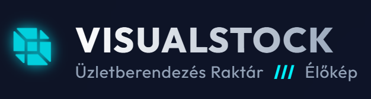
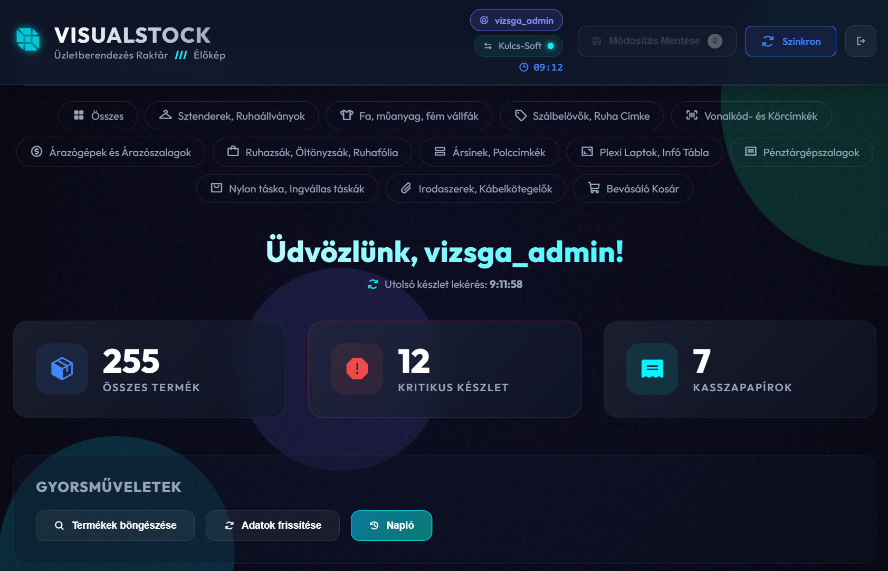
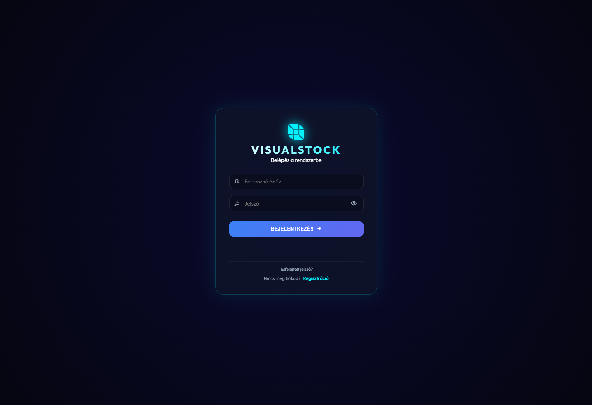

# 📦 VISUALSTOCK Premium
### Modern Üzletberendezés Raktárkezelő Rendszer

A **VisualStock** egy modern, **Neon/Cyberpunk** stílusú raktárkészlet-kezelő webalkalmazás (PWA), amelyet kifejezetten üzletberendezések (sztenderek, vállfák, árazók) nyilvántartására terveztek.

> 🚀 **Kulcs-Soft ERP Kompatibilis** | 📱 **PWA Támogatás** | 🔐 **Supabase Backend & RLS Security**

---

## ✨ Legújabb Funkciók (v36.0 - RBAC kiadás)

- [x] **Irányítópult (Dashboard)**: Szerepkörfüggő funkciókkal bővített vezérlőpult statisztikákkal.
- [x] **Kiberbiztonság (RLS & Hashing)**: A jelszavak SHA-256 algoritmussal titkosítottak, az adatbázis megóvásáról pedig a Supabase Row Level Security (RLS) gondoskodik.
- [x] **Szerepkör alapú hozzáférés (RBAC)**: Háromszintű jogosultságkezelés (Admin, Editor, Reader) biztosítja az adatvédelmet.
- [x] **Módosítási Napló (Audit Trail)**: Adminisztrátorok számára elérhető vizuális módosítási előzmény-napló.
- [x] **Rugalmas Készletmódosítás**: A készletértékek nemcsak a '+/-' gombokkal, hanem közvetlen (manuális) számbevitellel is villámgyorsan felülírhatók.
- [x] **Tesztelői (QA) Védelmi Rendszer**: Tranzakciós határérték védelem (TC-03) és folyamatmegszakítás (TC-04).
- [x] **Biztonságos Regisztráció**: E-mail alapú fiók létrehozása. Újbóli megnyitáskor automatikus mezőürítés és jelszó-elrejtés.
- [x] **ERP Szinkron Jelzés**: Élő visszajelzés az utolsó adatszinkronizáció időpontjáról.
- [x] **Okos Termékfotók**: Automatikus képkeresés és intelligens neon placeholder rendszer.

---

## 🏗️ Rendszer Architektúra és Szinkronizáció

A rendszer integrációs tervezése során a **Kulcs-Soft ERP** lett kijelölve elsődleges adatforrásnak ("Master Database"). 
Ennek értelmében a webes felületen (VisualStock) szándékosan **nincs lehetőség új termékek rögzítésére vagy törlésére**. A weblap elsődleges funkciója a gyors raktári navigáció és az egyes termékek készletszintjének precíz, helyszíni felülírása/korrigálása. Új termék bevezetése minden esetben a Kulcs-Soft rendszerből indul, amelyet a backend robotok szinkronizálnak a Supabase felhőbe.

---

## 📸 Képernyőképek

### 🏠 Irányítópult & Terméklista

### 🔐 Bejelentkezés & Regisztráció

### 💳 Termékkártyák (Adatok és Fotók)

---

## 🛠️ Technológiai Háttér

- **Frontend**: HTML5, Vanilla CSS3, JavaScript (ES6+).
- **Backend / DB**: Supabase (PostgreSQL, Row Level Security).
- **Képforrás**: Vallfa.hu integráció.
- **Ikonok**: [Phosphor Icons](https://phosphoricons.com/).
- **Betűtípus**: [Outfit](https://fonts.google.com/specimen/Outfit).

---

## 🔐 Hozzáférés és Jogosultságok

A rendszer három különböző szintű hozzáférést biztosít (RBAC - Role-Based Access Control). Regisztrációkor mindenki automatikusan "Reader" szerepkört kap.

| Szerepkör | Hozzáférés / Feladatkör | Létrehozás Módja |
|:---:|:---:|:---:|
| **Reader (Olvasó)** | Csak olvashatja a statisztikákat és a készletet. | Automatikus a regisztráció után. |
| **Editor (Szerkesztő)** | Készletszintet módosíthat (+/- gombokkal vagy közvetlen számbevitellel). | Manuális adatbázis (SQL) szintű emelés (`role='editor'`). |
| **Admin (Rendszergazda)** | Készletmódosítás, szinkronizáció + Módosítási Napló (Audit) megtekintése. | Manuális adatbázis (SQL) szintű emelés (`role='admin'`). |

---

## 🔐 Teszteléshez és Vizsgáztatáshoz (Demo Accounts)

A vizsgabizottság számára dedikált próbafiókok az új RBAC (Role-Based Access Control) rendszer teszteléséhez:

**1. Adminisztrátor (Teljes kontroll)** - Látja a naplót, tud szinkronizálni és raktárt kezelni.
* E-mail cím / Felhasználónév: `vizsga_admin`
* Jelszó: `Vizsga2026!`

**2. Készletkezelő (Szerkesztő)** - Csak a készletet tudja módosítani (Nincs Napló).
* E-mail cím / Felhasználónév: `vizsga_editor`
* Jelszó: `Vizsga2026!`

**3. Megfigyelő (Olvasó)** - Csak olvashat, minden manipulációs gomb rejtve.
* E-mail cím / Felhasználónév: `vizsga_reader`
* Jelszó: `Vizsga2026!`

---

## 🔗 Élő Elérés
🌐 **Weboldal:** [https://visualstock-vizsga.vercel.app/](https://visualstock-vizsga.vercel.app/)

---

## 🛠️ Futtatás és Üzembe helyezés

Az alkalmazás teljes mértékben felhőalapú (Supabase backend), így a futtatásához nincs szükség helyi szerver (localhost) telepítésére.

* **Élő verzió:** [visualstock-vizsga.vercel.app](https://visualstock-vizsga.vercel.app/) (A Vercel hosting automatikusan, a GitHubra történő 'push' után frissül).

* **Helyi tesztelés:** A tároló klónozása (vagy letöltése) után az `index.html` fájl bármely modern böngészőben közvetlenül megnyitható és futtatható.

> [!IMPORTANT]
> **FONTOS MEGJEGYZÉS AZ ADATBIZTONSÁGRÓL:** Az adatbázis illetéktelen hozzáférés elleni védelmét a Supabase RLS (Row Level Security) házirendjei biztosítják, amelyek az élő szerveren már aktívak. A beállított biztonsági szabályok kódja ellenőrzés céljából a repository-ban található `supabase_security.sql` fájlban tekinthető meg.

## 📱 Mobilos Használat (PWA)
1. Nyisd meg a fenti **Vercel** linket Chrome/Edge böngészőben.
2. Koppints a **"Telepítés"** vagy **"Hozzáadás a főképernyőhöz"** gombra.
3. Indítsd el az alkalmazást közvetlenül a telefonodról!

---

## 👥 Készítők
**Bujdosó Rita**, **Kunszt Viktor**, **Makkai Rebeka**

---

© 2026 VisualStock Premium - V36.0 (RBAC & Audit Trail Update)
